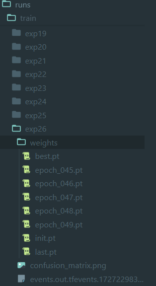
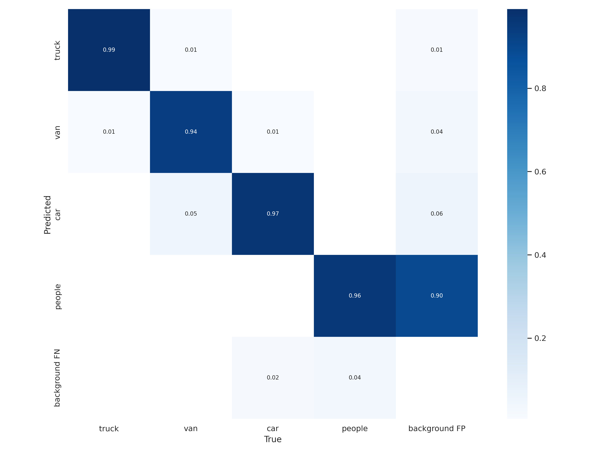

## 数据集下载与解压
访问百度[网盘链接](https://pan.baidu.com/s/1WwHYtdskxHhUGqCbWwqrEQ?pwd=n0jk) 下载数据集至当前文件夹。
解压数据集：
``` unzip dataset.zip  ```

## 环境准备
建议python版本为3.8，安装依赖：
``` pip install -r requirements.txt```

## 模型原理

本算法所用的模型是一种实时目标检测模型。它的设计目标是通过单次前向传播来预测图像中的目标类别和位置。模型将整个图像划分为多个网格，每个网格负责预测多个边界框和对应的类别概率。通过这种方式，模型能够在保持高精度的同时实现快速的目标检测。

### 模型架构
模型的架构包括以下几个部分：
1. **输入层**：接受输入图像并进行预处理。
2. **特征提取层**：使用卷积神经网络提取图像的特征。
3. **检测层**：在特征图上进行目标检测，预测边界框和类别概率。
4. **输出层**：输出最终的检测结果，包括边界框坐标和类别标签。

## 训练与代码原理

训练代码位于 [train.py](train.py) 文件中。训练过程包括以下几个步骤：
1. **数据加载**：从数据集中加载训练数据，并进行数据增强。
2. **模型初始化**：初始化 YOLOv7 模型，并加载预训练权重（如果有）。
3. **损失函数**：定义损失函数，包括分类损失、定位损失和置信度损失。
4. **优化器**：选择优化器（如 Adam 或 SGD）并设置学习率。
5. **训练循环**：在训练数据上迭代模型，计算损失并更新模型权重。
6. **保存模型**：在每个 epoch 结束时保存模型权重。

运行以下命令开始训练：
``` python train.py ```
训练完在runs/train/expxx目录下可以查看训练结果，该目录下的wights/best.pt 为训练好的模型权重。如图：


## 测试与代码原理
测试代码位于 test.py 文件中。测试过程包括以下几个步骤：

1. **加载模型**：加载训练好的 YOLOv7 模型权重。
2. **数据加载**：从测试集中加载测试数据。
3. **前向传播**：将测试图像输入模型，进行前向传播以获得检测结果。
4. **后处理**：对模型输出的边界框进行非极大值抑制（NMS），去除冗余的检测框。
5. **评估结果**：计算检测结果的评估指标，如精度、召回率和 F1 分数。

``` python test.py  --weights "runs/expxx/train/weights/best.pt"```  或 ```python test.py  --weights best.pt```，其中expxx是实际实验中产生的具体文件夹,best.pt是训练好的权重。

## 测试结果查看
runs/test/expxx下是具体的模型测试结果，主要是混淆矩阵confusion_matrix.png 如图。


## 指标对应
**TODO**